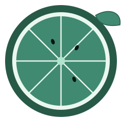

<div align="center">



# Lime

**A reverse proxy & load balancer, built from scratch in Go.**

Built by [Allenize](https://github.com/Allenize) · pure standard library · zero dependencies

[](https://github.com/YOUR_USERNAME/lime/actions/workflows/ci.yml)
[](https://goreportcard.com/report/github.com/YOUR_USERNAME/lime)
[](https://go.dev/)
[](./LICENSE)

</div>

---

> **Status:** working reverse proxy with round-robin load balancing and automatic health-check failover.

##  Overview

Lime is a hand-built reverse proxy and load balancer, made to understand — and eventually match — what tools like Traefik and nginx do under the hood. No frameworks, no third-party routers: just Go's standard library.

##  Features / Roadmap

- [x] Health check endpoint
- [x] Reverse proxy request forwarding
- [x] Load balancing (round robin)
- [x] Backend health checks (automatic failover)
- [ ] Least-connections balancing strategy
- [ ] Simple admin dashboard
- [ ] TLS support

##  Project layout

```
lime/
├── .github/workflows/ci.yml   # CI: format, vet, build, test on every push
├── cmd/lime/main.go           # entrypoint (the binary you run)
├── internal/balancer/         # load balancing algorithms (round robin, etc.)
├── internal/proxy/            # reverse proxy / request forwarding logic
├── docs/assets/               # logo + icons used in this README
├── Dockerfile                 # containerized build, for free deployment anywhere
├── go.mod
└── README.md
```

##  Run locally

Lime needs at least one backend server to forward traffic to. Configure backends via the `BACKENDS` environment variable (comma-separated URLs):

```bash
BACKENDS="http://localhost:9001,http://localhost:9002" go run ./cmd/lime
```

If `BACKENDS` isn't set, it defaults to a single backend at `http://localhost:9001`.

Visit `http://localhost:8080/health` to confirm Lime itself is up. Requests to `http://localhost:8080/` are load-balanced across your configured backends, and unhealthy backends are automatically removed from rotation.

##  Run with Docker

```bash
docker build -t lime .
docker run -p 8080:8080 lime
```

##  Deploying (Render — free, no expiration)

Lime reads the `PORT` environment variable (falls back to `8080` locally), which is what Render and most hosts require.

1. Push this repo to GitHub
2. Go to [render.com](https://render.com) → sign up / log in → connect your GitHub account
3. **New** → **Web Service** → select this repo
4. Render auto-detects the `Dockerfile` — leave build/start commands as-is
5. Choose the **Free** instance type
6. Under **Advanced**, set:
   - **Health Check Path**: `/health`
   - **Environment Variable**: `BACKENDS` = your comma-separated backend URLs
7. Click **Create Web Service**

From then on, every `git push` to `main` auto-deploys. Note: free instances spin down after 15 minutes of no traffic and take ~30-60 seconds to wake back up on the next request — fine for a personal project, not for production traffic.

##  Development

```bash
go build ./...   # build
go vet ./...      # static analysis
gofmt -l .          # check formatting
go test ./...      # run tests
```

These are the exact same checks CI runs on every push — running them locally before pushing keeps CI green.

## Brand palette

<div align="center">

 &nbsp;
 &nbsp;
 &nbsp;


</div>

---

<div align="center">

**Built by Allen**

[](https://github.com/Allenize)

</div>
